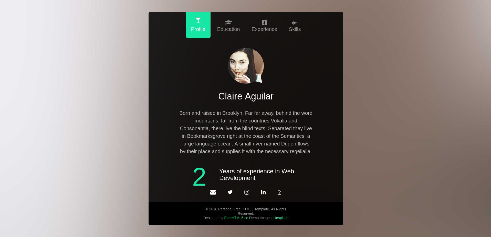
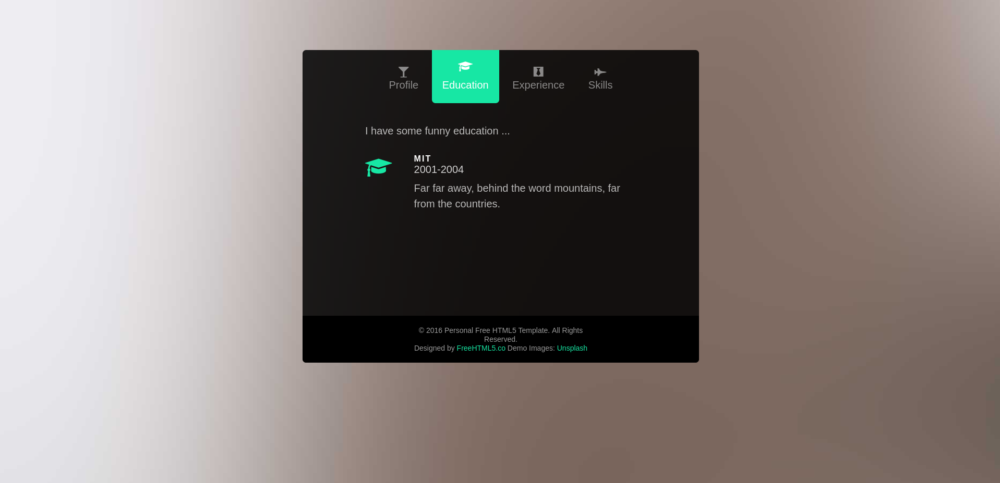
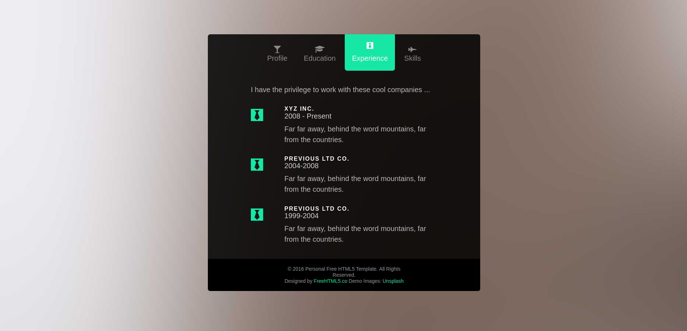
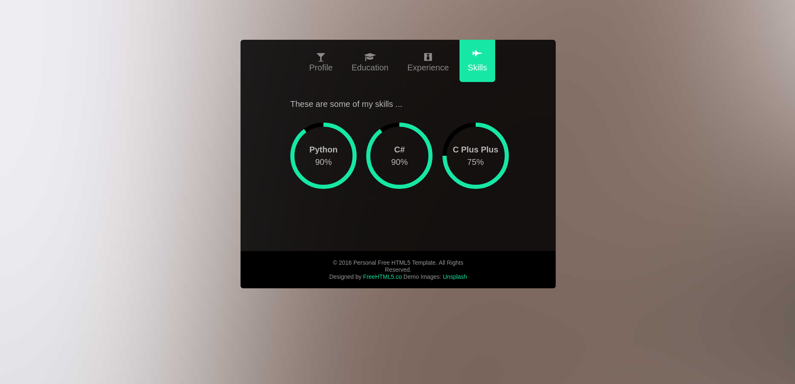

# Personal Resume Website

## Table of Contents
* [General Info](#general-information)
* [Technologies Used](#technologies-used)
* [Screenshot](#screenshot)
* [Project Status](#project-status)
* [Contact](#contact)

## General Information
- This project is a website for resume or personal introduction, with an admin panel for managing contents
- I don't have any credit for front-end of the website

## Technologies Used
- C# (.NET 6)
- SQLite
- JavaScript
- HTML, CSS

## Screenshot
- Profile

- Educations

- Experiences

- Skills

## Project Status
- Project is: _completed_

## Contributing
- PRs and everything about contributing will be welcome :)

## Contact
- Created by [Pouria Khakpour](https://github.com/0ne-zero) - feel free to contact me!
- You can reach me by pouria.khakpour9909@gmail.com
